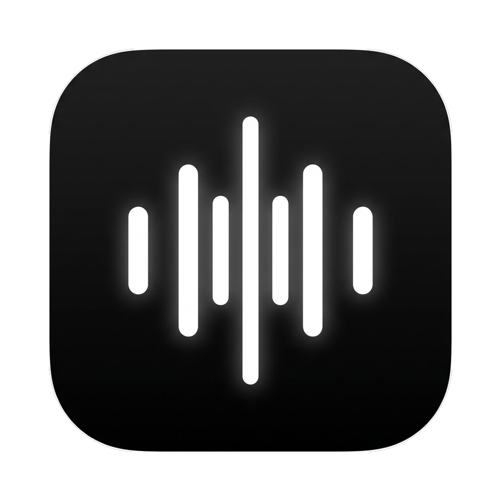

<div align="center">



# ⚡ KERYX (κῆρυξ)
### *The Blazingly Fast, Cross-Platform AI Voice Dictation Engine in Pure Rust*

**Zero Bloat. Zero Telemetry. Sub-200ms Latency. 100% Free & Open Source.**  
*Because nobody should have to pay $20/month for an Electron bloatware app that devours 600MB of RAM just to paste text.*

[](https://www.rust-lang.org/)
[](https://www.apple.com/macos/)
[](https://www.microsoft.com/windows/)
[](https://kernel.org/)
[]()
[](LICENSE)

</div>

---

## 🏛️ The Lore: What is "Keryx"?

In Ancient Greece, the **Kēryx (κῆρυξ)** was the sacred herald and divine messenger. Endowed with the gift of effortless speech and lightning velocity, the Kēryx commanded absolute silence and delivered spoken proclamations across kingdoms with 100% precision.

**Keryx** is the modern incarnation of that sacred herald: a featherweight, native Rust engine that turns your spoken thoughts into articulate, perfectly formatted prose at your cursor—before you can even blink.

---

## ⚡ The Manifesto: Why Keryx Outperforms Every VC Startup

Let’s be brutally honest for a moment.

The modern AI startup playbook for voice dictation is fundamentally broken:
1. Slap a 50-line Python wrapper around an API call.
2. Shove it into an **Electron** wrapper running a full Chromium browser + Node.js runtime.
3. Watch it eat **500MB to 800MB of your precious RAM**.
4. Stream your private microphone audio to their proprietary telemetry cloud.
5. Charge your credit card **$15 to $30 every single month**.
6. When your WiFi blinks at an airport? *Your keyboard stops working.* 💀

```
Electron Bloatware Startup:
[Audio] ➔ [Chromium IPC] ➔ [Node Engine] ➔ [Cloud Server] ➔ [HTTP Roundtrip] ➔ [Laggy Webview]
   ⏱️ 1,200ms - 2,500ms latency  |  📦 650 MB RAM  |  💸 $20/month

Keryx (Pure Rust):
[Microphone] ➔ [CoreAudio / CPAL RingBuffer] ➔ [Metal GPU / Groq LPU] ➔ [OS Native Keystroke]
   ⏱️ 150ms - 250ms latency    |  📦 ~18 MB RAM   |  💸 $0.00 Forever
```

**Keryx runs circles around closed-source startups** because it compiles down to bare-metal native machine code. It talks directly to OS audio hardware, accessibility APIs, and hardware acceleration engines (Apple Silicon Metal, NVIDIA CUDA, or Groq LPUs).

---

## 📊 Comparative Smackdown: Keryx vs The Competition

| Capability | ⚡ **Keryx (Rust)** | 💸 **Wispr Flow / Superwhisper** | 🍎 **macOS / Win Dictation** | 🦖 **Dragon / Nuance** |
| :--- | :--- | :--- | :--- | :--- |
| **Price** | **$0.00 (Free & Open Source)** | $10 – $20 / month ($240/yr!) | Included with OS | $500 enterprise boomerware |
| **RAM Footprint** | **~18 MB** (Featherweight) | ~400 MB – 800 MB (Electron) | ~120 MB | ~1.4 GB |
| **Cross-Platform** | **macOS, Windows & Linux** 🌐 | macOS-only (or split apps) | OS-locked | Windows-only |
| **Roundtrip Latency** | **~180ms – 250ms** (Warp speed) | 800ms – 2,000ms | 600ms – 1,500ms | Slow / sluggish |
| **Offline Privacy** | **100% Local (Metal GPU / CUDA)** | Cloud-tethered (Most tiers) | Limited | Local |
| **Smart Self-Correction** | **Yes** (Fixes stutters & slips) | Yes (Cloud LLM) | ❌ No (Types raw mistakes) | ❌ No |
| **Code & Technical Jargon** | **Flawless** (`gRPC`, `MIMD`, `Kubernetes`) | Decent | ❌ "see plus plus" -> "C+++" | ❌ Fails on modern dev stacks |
| **HUD Overlay** | **Bespoke Native HUD (< 0.01% CPU)** | Clunky webview overlay | Default microphone bubble | 1990s floating toolbar |
| **Telemetry / Tracking** | **Zero. None. Open Source.** | Closed source tracking | Big Tech telemetry | Enterprise tracking |

---

## 🌐 True Cross-Platform Architecture

Keryx was architected with zero platform lock-in. Whether you're coding on a MacBook Pro, compiling on Arch Linux, or gaming on Windows 11, Keryx gives you identical low-latency voice dictation:

```
                      ┌──────────────────────────────────────────────┐
                      │              KERYX CORE (Rust)               │
                      │  • Lock-Free Audio RingBuffer (CPAL)         │
                      │  • Audio Pre-Processing & RMS Equalizer      │
                      │  • State Machine & Event Dispatcher          │
                      └──────────────────────┬───────────────────────┘
                                             │
         ┌───────────────────────────────────┼──────────────────────────────────┐
         ▼                                   ▼                                  ▼
┌──────────────────┐               ┌──────────────────┐               ┌──────────────────┐
│     macOS 🍎     │               │    Windows 🪟    │               │     Linux 🐧     │
│ • CoreAudio / Metal│              │ • WASAPI / DirectX│              │ • ALSA / Pulse / Pipe│
│ • AppKit HUD Panel │              │ • Tray & WinToast │              │ • libnotify / HUD    │
│ • CGEvent Paste  │               │ • SendInput API  │               │ • X11 / Wayland Paste│
│ • Native `say` TTS│              │ • SAPI / PS Sound │              │ • `aplay` / Native   │
└──────────────────┘               └──────────────────┘               └──────────────────┘
```

* **🍎 macOS**: Native Cocoa/AppKit borderless HUD panel, Metal GPU `whisper.cpp` acceleration, and CGEvent accessibility keystroke synthesis.
* **🪟 Windows**: High-performance WASAPI audio streams, Windows Notification Toast/Tray integration, DirectX/CUDA whisper inference, and `SendInput` keyboard dispatch.
* **🐧 Linux**: First-class support for ALSA, PulseAudio, and PipeWire, working seamlessly across X11 and Wayland compositors.

---

## 🚀 The Warp-Speed Latency Tuning Guide

Want Keryx to feel like raw telepathy? Here is how to eliminate latency down to the physical limit:

### 1. ⚡ The Groq LPU Highway (Fastest Cloud Pipeline: ~200ms)
[Groq](https://groq.com) runs specialized Language Processing Unit (LPU) silicon that processes Whisper and Llama models at over **300 tokens per second**.

Edit your `~/.config/keryx/.env`:
```ini
TRANSCRIPTION_PROVIDER=groq
LLM_PROVIDER=groq
GROQ_API_KEY=gsk_your_free_groq_key_here
```
* **STT Latency:** ~120ms (Whisper Large v3 on Groq LPU)
* **LLM Cleanup:** ~80ms (Llama-3.3-70B on Groq LPU)
* **Total Roundtrip:** **~200ms!** By the time your finger lifts off the key, the text has already landed at your cursor.

---

### 2. 🛡️ The Air-Gapped Local Beast (Metal GPU / NVIDIA CUDA)
No internet connection required. 100% private. Works at 35,000 feet on an airplane.

Run `make setup` to compile `whisper.cpp` with Apple Silicon **Metal GPU acceleration** (`GGML_METAL=1`) or CUDA:
```ini
TRANSCRIPTION_PROVIDER=local
LLM_PROVIDER=none
WHISPER_MODEL=~/.config/keryx/models/ggml-small.en.bin
```
* **Latency:** ~150ms – 250ms directly on the M-Series GPU or NVIDIA RTX Tensor Cores.
* **Zero API Cost.** Unlimited words forever.

---

### 3. 🎯 The "Raw Reflex" Mode (Zero LLM Overhead)
If you speak clearly or are dictating code/raw snippets, skip the LLM post-processing pass entirely:
```ini
LLM_PROVIDER=none
```
Transcribed audio is streamed straight to the clipboard and pasted into your active window with **0ms LLM delay**.

---

## ✨ Features & Polish

* **🎯 Top-Screen Minimalist HUD**: A sleek, pitch-black Apple glass pill anchored flush at the top-middle of your screen with live animated equalizer sticks and smooth in-place opacity transitions.
* **🎙️ Smart Dual-Mode Hotkey**:
  * **Hold-to-Talk**: Hold `Right Option` (or `Right Shift`) while speaking; release to instantly transcribe & paste.
  * **Double-Tap Hands-Free**: Double-tap the hotkey to toggle an ambient, continuous dictation session.
* **🧠 Contextual Grammar & Self-Correction**: Intelligently cleans false starts and verbal slips (e.g. *"let's meet at two—actually three PM tomorrow"* ➔ *"Let's meet at 3:00 PM tomorrow."*) while preserving your exact voice and perspective.
* **⌨️ Universal Direct-to-Cursor Injection**: Works everywhere—VS Code, Obsidian, Notion, Slack, Terminal, Chrome, Discord, Xcode, and JetBrains IDEs.

---

## 🛠️ Quick Start & Installation

### Prerequisites
* Rust 1.75+ toolchain (`curl --proto '=https' --tlsv1.2 -sSf https://sh.rustup.rs | sh`)
* macOS, Windows 10/11, or modern Linux

### 1. Clone & Launch
```bash
git clone https://github.com/your-username/keryx.git
cd keryx

# Build and run with live terminal output
make run
```

### 2. Setup Local Offline STT (Optional)
```bash
# Downloads and compiles whisper.cpp with Metal GPU / CUDA acceleration
make setup
```

### 3. Configuration Cheat Sheet (`~/.config/keryx/.env`)
```ini
# Hotkey: right_alt, right_shift, right_ctrl, fn
HOTKEY=right_alt

# Providers: groq | nvidia | local | openai
TRANSCRIPTION_PROVIDER=groq
LLM_PROVIDER=groq

GROQ_API_KEY=gsk_...
NVIDIA_API_KEY=nvapi-...
```

---

## 📦 Makefile Targets

| Command | Action |
| :--- | :--- |
| `make run` | Compiles debug binary and launches Keryx with live logs |
| `make build` | Compiles stripped, optimized release binary to `target/release/keryx` |
| `make setup` | Downloads & compiles `whisper.cpp` with local GPU acceleration |
| `make app` | Packages a native standalone `Keryx.app` macOS application bundle |
| `make install` | Installs the binary directly to `/usr/local/bin/keryx` |
| `make clean` | Cleans build artifacts and caches |

---

## 🔒 Security & Privacy Promise

Keryx operates under a strict privacy doctrine:
* **Zero telemetry.** No tracking pixels, no user analytics, no background telemetry pings.
* **Zero keystroke logging.** Keyboard hooks only monitor the single chosen hotkey modifier.
* **Local audio buffers.** Audio is held in RAM buffers and discarded immediately after transcription.

---

<div align="center">
<b>KERYX (κῆρυξ) — Engineered in Rust for those who speak at the speed of thought.</b>
</div>
